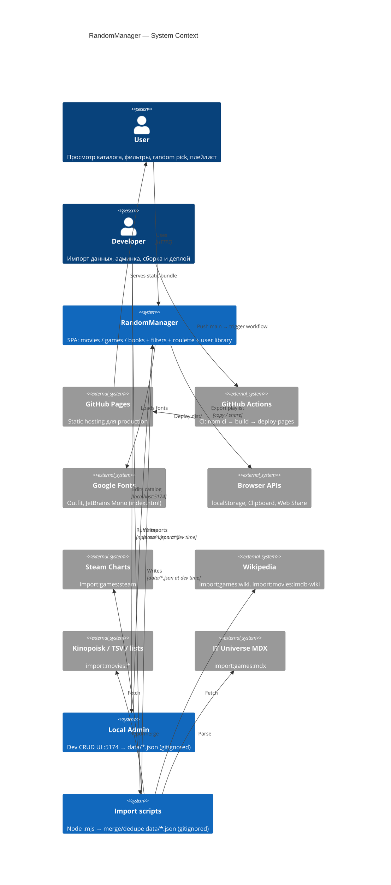
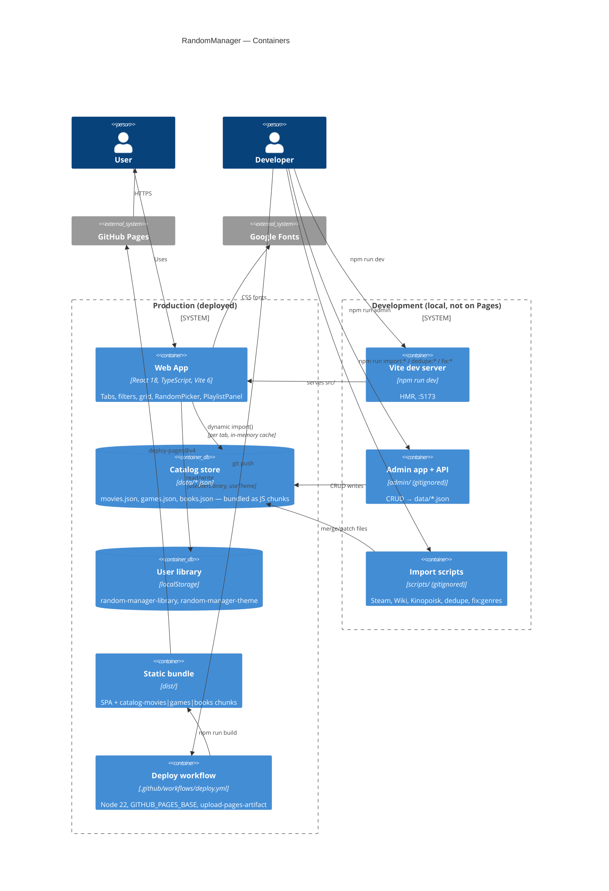
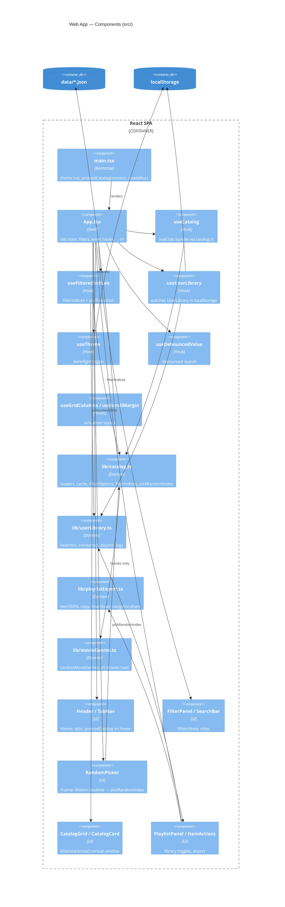
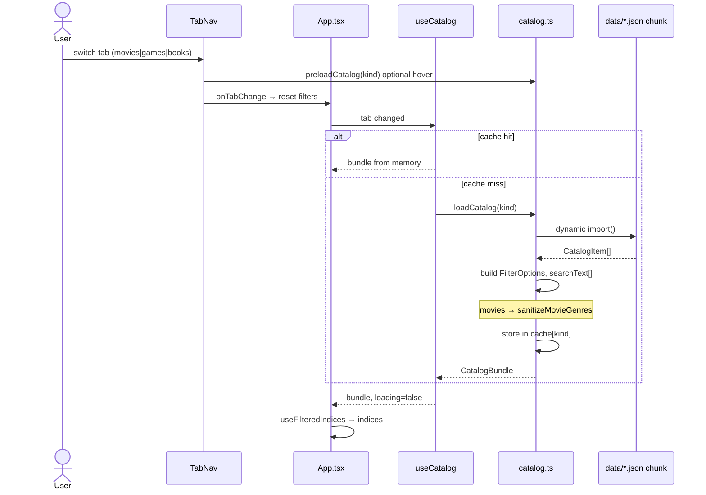
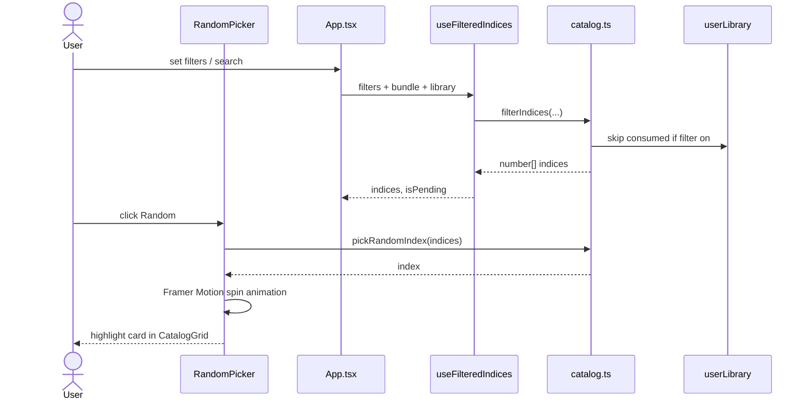
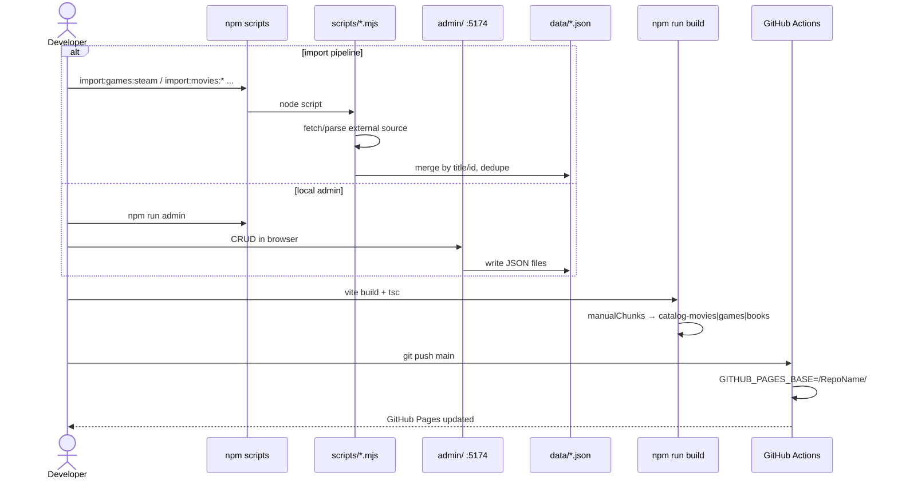
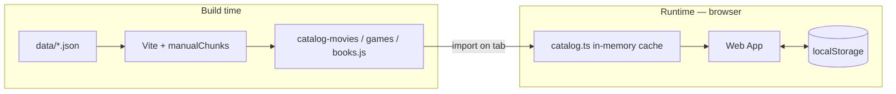

# RandomManager

SPA-каталог **фильмов**, **игр** и **книг** со случайным выбором с учётом фильтров. Статический сайт для [GitHub Pages](https://pages.github.com/).

## Возможности

- Три раздела: кино (жанры, актёры, рейтинг), игры (жанр, год, разработчик, платформа), книги (автор, год, жанр)
- Поиск и фильтры (жанры, год, рейтинг, актёры / разработчик / платформы / авторы)
- **Случайный выбор** по текущей вкладке и активным фильтрам, с анимацией «рулетки»
- Тёмная тема по умолчанию, переключение на светлую
- Каталог в папке [`data/`](data/) — JSON (удобно править вручную; SQLite на GH Pages без сервера не используется)

## Локальная разработка

```bash
npm install
npm run dev
```

## Сборка

```bash
npm run build
npm run preview
```

Для деплоя в **корень** `username.github.io` задайте при сборке:

```bash
# Windows PowerShell
$env:GITHUB_PAGES_BASE="./"; npm run build
```

Для репозитория `RandomManager` workflow уже подставляет `base: /RandomManager/`.

## Android-приложение

APK лежит в [`public/RandomManagerMobile.apk`](public/RandomManagerMobile.apk) и попадает в сборку как статический файл. На сайте в шапке есть ссылка «Скачать APK». Чтобы обновить билд, скопируйте свежий `.apk` из мобильного проекта в `public/`.

## Публикация на GitHub Pages

1. Залейте репозиторий на GitHub.
2. **Settings → Pages → Build and deployment**: Source — **GitHub Actions**.
3. Запушьте в `main` / `master` — сработает [`.github/workflows/deploy.yml`](.github/workflows/deploy.yml).

## Редактирование каталога

| Файл | Содержимое |
|------|------------|
| `data/movies.json` | `title`, `year`, `genres[]`, `actors[]`, `rating`, `description` |
| `data/games.json` | + `developer`, `platforms[]` |
| `data/books.json` | + `author` |

После изменения JSON пересоберите проект (`npm run build`).

### Импорт из внешних источников

| Команда | Источник |
|---------|----------|
| `npm run import:games:mdx` | IT Universe `docs/tools/games/4.mdx` — полный алфавитный список |
| `npm run import:games:steam` | [Steam Charts — сейчас играют](https://store.steampowered.com/charts/mostplayed?l=russian) (топ‑100, ~1 мин) |
| `npm run import:games:wiki` | [Wikipedia — best-selling video games](https://en.wikipedia.org/wiki/List_of_best-selling_video_games) (~50 позиций) |

Скрипты дополняют `data/games.json`, не затирая уже существующие записи (сопоставление по названию). Для Steam подтягиваются жанры, год, разработчик и ссылка на страницу магазина.

### Локальная админка

Папка `admin/` в `.gitignore` — не попадает на GitHub Pages. Удобный CRUD-интерфейс с записью прямо в `data/*.json` (нужен dev-сервер с API):

```bash
cd admin && npm install && npm run dev
# или из корня:
npm run admin
```

Откройте http://localhost:5174 — создание, правка, удаление, теги для жанров/актёров/платформ. Для публикации сайта после правок: `npm run build` в корне.

## Стек

- [Vite](https://vitejs.dev/) + React + TypeScript
- [Framer Motion](https://www.framer.com/motion/) — анимации
- [@tanstack/react-virtual](https://tanstack.com/virtual) — виртуализация сетки каталога

## Architecture / Архитектура

Модель [C4](https://c4model.com/): **Context → Containers → Components**, плюс sequence для ключевых сценариев.  
Production — только статика на GitHub Pages; **dev-контур** (`scripts/`, `admin/`) в репозиторий не коммитится (см. `.gitignore`), но участвует в жизненном цикле каталога.

> Диаграммы — [Mermaid C4](https://mermaid.js.org/syntax/c4.html). Рендер: GitHub, VS Code (Mermaid), [mermaid.live](https://mermaid.live).

### Level 1 — System Context



### Level 2 — Containers



### Level 3 — Components (Web App)



### Dynamic — загрузка вкладки каталога



### Dynamic — random pick с фильтрами



### Dynamic — dev: обновление каталога



### Data — сущности и хранение

| Layer | Location | Contents |
|-------|----------|----------|
| **Catalog** | `data/movies.json`, `games.json`, `books.json` | Immutable at runtime; shipped as separate Vite chunks |
| **User library** | `localStorage` key `random-manager-library` | Per-item: `favorite`, `consumed`, `inPlaylist` by `CatalogKind` + `id` |
| **Theme** | `localStorage` key `random-manager-theme` | `dark` \| `light` |
| **Types** | `src/types.ts` | `Movie`, `Game`, `Book`, `FiltersState`, `CatalogKind` |


